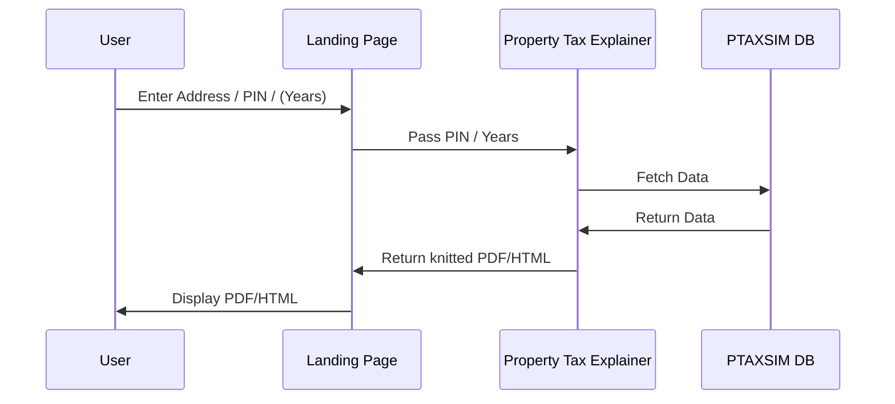

# Property Tax Explainer

## Goal

Allow users, from a primarily non-technical background, to understand how the taxes on their property are calculated with a focus on how total amount changes from year to year. It should be easy to understand - brevity preferred over explicit detail. 

## Format

The explainer should be easily accesible, and minimally interactive. The actual explainer should ideally be printable into a single page with minimal friction.

## Control Flow

## Landing Page

Landing page should have a simple form with the following fields:

1. Enter property address / PIN
2. Enter years to compare (Optional: default to 2023 vs 2022)

This is then passed to the Property Tax Explainer. (Address parsed to PIN)

## Property Tax Explainer

The explainer should only take as input the PIN and the years to compare. It should then fetch the data from the PTAXSIM DB and return a knitted PDF/HTML to the Landing Page.

### Flow of the Explainer

- For PIN, compare total value of 2 tax years
- Show the *change* (through text, visualisations etc) in total value broken down into:
    - Change in Effective Tax Rate
    - Change in Equalized Assessed Value

This presents a simple 2-sided comparison of the total tax amount, into values that are in the control of the tax payer vs not in control of the tax payer.

- Further break down "Change in Effective Tax Rate" into the following -
    - Change in Tax Rate per district
        - Change in Levy per district
        - Change in Base per district

- Further break down "Change in Equalized Assessed Value" into the following -
    - Change in Assessed value
    - Change in exemptions (if any)
        - Show all possible exemptions
    - Change in equalization factor

Wherever needed, show an explanation of the terms used, and calculations to derive the values.

- Also show TIFs, if any, and how they affect the total tax amount.

**The goal is to explain the change in total tax amount, what drives those changes, and the underlying mechanics of said changes.**
A secondary goal is to show how the tax amount is used, and where the different funnels of the tax amount go to.